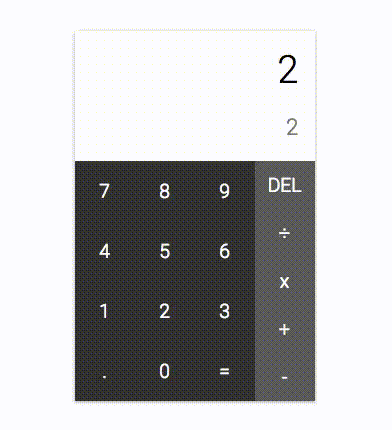
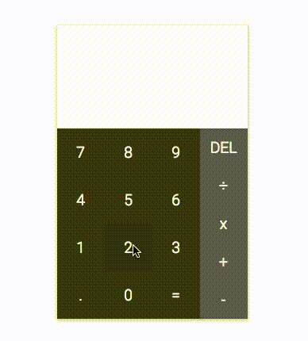
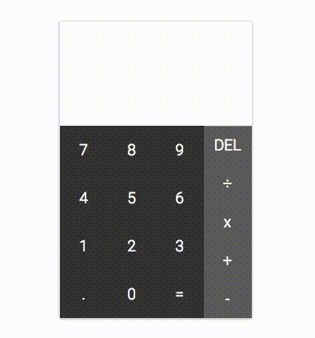

# React Calculator 

A calculator styled after Google Pixel's calculator. It does what you expect it to: add, subtract, multiply and divide. Use the mouse pointer or the numbers on your keyboard. 

Go wild. Do math. 

## Features 

Calculating on the keyboard 

Calculating with the mouse 

Text responsiveness 

## Built With
* [React](https://reactjs.org/) - a JavaScript library 
* JavaScript 
* CSS/HTML 

## To do
- [ ] Replace using `eval()`, because eval === evil 
- [x] Restrict operators to come after number input
- [x] Restrict user to no `0`s as the first input
- [ ] When user clicks `÷`, show `÷` instead of `/`
- [ ] When user clicks `x`, show `x` instead of `*` 
- [x] Fix `Return` keypress (currently clears value)
- [ ] Sometimes `Return` on multiplication clears the screen 
- [ ] Allow user `0`s as first input (because decimals start with `0`s)